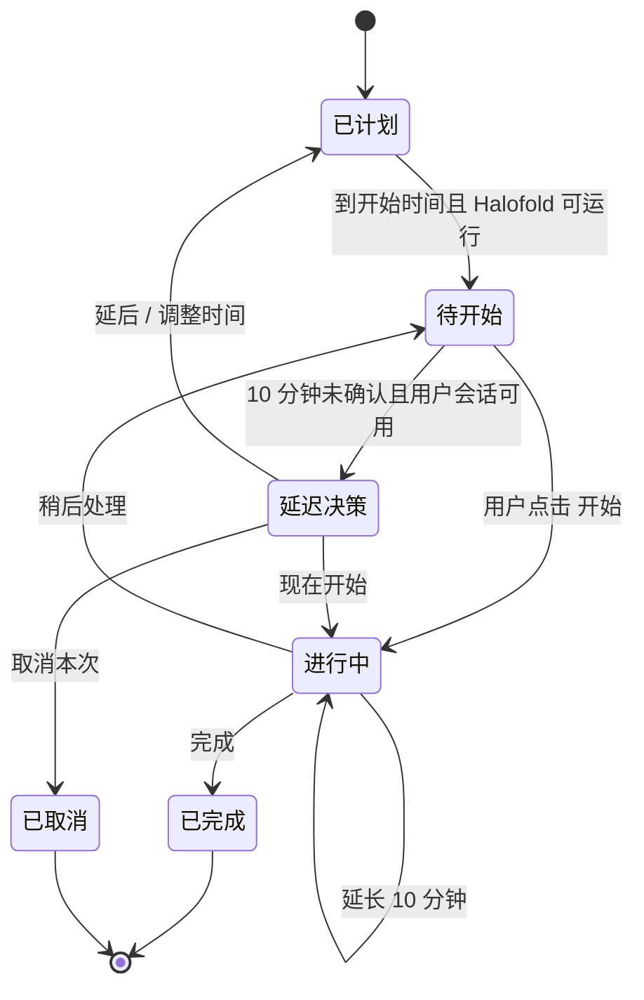

# Halofold 我的日程 — 产品与交互契约

状态：已确认，可进入开发拆分。
产品名：Halofold（历史工程名 Codex Island）。
数据范围：仅本机；不登录、不云同步。

## 1. 产品目标

“我的日程”帮助用户把固定时间段的个人计划放进 Halofold，而不是分散在日历、闹钟和其他协作工具里。

它的核心不是做一个日历，而是在用户正在使用 Mac 时：

- 让用户按周安排每天的时间块；
- 在开始时间用语音提醒；
- 只有用户确认后才开始记录实际专注用时；
- 计划延迟时，主动帮助用户做出延期、调时或取消的选择；
- 用低打扰规则提醒喝水、起身活动等例行事项。

## 2. 已确认的产品边界

### 包含

- 周计划：查看本周及未来周，按天安排时间块。
- 同页新增与编辑：项目名称、开始时间、持续时长；重复规则放在“更多设置”。
- 到点语音提醒、待开始、进行中倒计时、完成、延长、稍后处理。
- 延迟开工后的主动决策。
- 例行计划：喝水、起身活动及后续可扩展的低打扰规则。
- 本地保存的计划、实际开始/结束、完成、延长、跳过、取消和修正记录。
- 回看过去日期：默认冻结显示，可编辑当天或补记事项。
- 设置内按模块启用 `快速便签`、`Codex 跟进`、`我的日程`；至少保留一个模块启用。

### 不包含（长期边界）

- 飞书、Apple Calendar 或其他日历的双向同步。
- 多人日历、协作、跨设备同步。
- 复杂统计、图表型看板、独立“执行记录”Tab。
- 账号、服务端、云端数据。
- 为睡眠、锁屏、退出状态额外做系统通知或追补语音。

## 3. 信息结构

```text
设置 > 功能
├─ 快速便签
├─ Codex 跟进
└─ 我的日程

我的日程
├─ 本周计划
│  ├─ 周选择器（选择某一天）
│  ├─ 今天 / 未来：可安排、可编辑
│  └─ 过去：默认执行结果，可编辑当天 / 补记事项
└─ 例行计划
   ├─ 喝水
   ├─ 起身活动
   └─ 新增例行计划
```

“执行记录”不是独立入口。过去日期的日程行直接显示最终执行结果，因此计划和记录始终是同一份数据。

## 4. 页面与交互契约

### 4.1 模块设置

- 功能页展示三个模块的开关。
- 关闭模块只隐藏入口、停止该模块的显示与提醒；已有计划、便签、Codex 历史均不删除。
- 当仅剩一个已启用模块时，其开关不可再关闭；文案说明“至少保留一个功能”。
- 关闭“我的日程”时，停止待开始检查、倒计时与例行提醒；下次开启后恢复保存的计划，不补播错过的语音。

### 4.2 本周计划

- 顶部固定为两个分段切换：`本周计划 | 例行计划`。
- 本周计划顶部是单一周选择器：周一至周日、日期、任务数量或轻状态点；不在下方重复大号“周三 · 8 月 26 日”标题。
- 当前日可用“今天”标记；用户可前后切换周并选择任意一天。
- 今天与未来日期显示“下一件”和当天列表；过去日期进入第 4.5 节的历史状态。
- 列表行使用轻量分隔线，而非每行独立大卡片：
  - 左侧：开始时间；
  - 次级文字：持续时长和预计结束时间；
  - 中间：项目名称；
  - 右侧：更多操作。
- 删除不常驻“可恢复”说明；删除后用短暂的撤销反馈处理。
- “我的日程”不显示便签的富文本格式工具栏。

### 4.3 同页新建、编辑与重复

- “添加日程”直接在当天列表位置展开，不进入详情页。
- 字段固定顺序：`项目名称 → 开始时间 → 持续时长`。
- `更多设置`默认收起，包含一次性/重复规则等低频设置。
- 调整重复日程时，询问：`只改这次` 或 `修改后续`。
- 新建或调整与现有日程时间重叠时，显示非阻塞冲突提示；用户可以返回调整，也可明确确认保留重叠。系统不自动移动其他日程。
- 过去日期默认冻结，但每一项可经“更多操作”修正，页面级也可“编辑当天”或“补记事项”。界面展示最终状态；数据保留原计划与最终修正结果，不做版本历史页。

### 4.4 到点、延迟与专注计时



- 到点时，Halofold 在可运行且 Mac 用户会话可用时播报简短语音，并展示“待开始”。
- 语音提醒不等于已开工；实际开始时间只在用户点击“开始”后记录。
- 若开始时间过去 10 分钟仍未确认，Halofold 主动询问：
  - `现在开始`：从此刻开始完整计入原定时长；
  - `延后 10 分钟`：快捷改为 10 分钟后待开始；
  - `调整时间`：修改开始时间和/或持续时长；
  - `取消本次`：只取消当天该次，不删除重复计划。
- 例如 10:00 的 60 分钟任务在 10:12 确认开始，倒计时从 60:00 开始，预计结束时间为 11:12；原计划 10:00–11:00 同时保留为次级信息。
- 进行中主界面只突出：项目名、剩余时间、实际开始/预计结束，以及 `完成 / 延长 10 分钟 / 稍后处理`。
- `稍后处理`暂停当前计时，回到待开始；用户稍后自行确认开始，不自动追补语音。
- Mac 休眠、锁屏、退出应用或 Halofold 未运行时：不做系统通知兜底、不追补语音；后续打开应用时，仅按保存状态呈现该事项。

### 4.5 过去日期与执行结果

- 日期过去后，当天默认以冻结的执行结果展示：`已完成 · 实际 57 分钟`、`延长 10 分钟 · 实际 70 分钟`、`已跳过`、`已取消`或`未开始`。
- 默认不把历史行变成可编辑表单，避免误改；通过“编辑当天”、行的更多操作或“补记事项”显式进入修正。
- 修正后的页面仍展示最终状态；如需要提示，用轻量“已修正”标记即可。
- 例行提醒不逐条塞进当日历史，避免把日程回看变成提醒日志。

### 4.6 例行计划

- 通过 `本周计划 | 例行计划` 同页切换进入。
- 首批预设：
  - 喝水：默认每 40 分钟；
  - 起身活动：默认每 80 分钟。
- 每条例行规则可独立开关，支持设置间隔；运行条件固定为“电脑唤醒且未锁屏”。
- 规则触发时使用简短提醒；若有进行中的专注时段，则合并到专注结束后提示一次，避免打断。
- 规则和执行状态仅保存在本机。例行提醒不要求用户逐次完成，也不产出复杂统计。

## 5. 最小本地数据

| 数据对象 | 必要字段 |
|---|---|
| 日程模板 | 标题、开始时间、时长、重复规则、是否启用 |
| 单次日程 | 日期、计划开始/结束、来源模板、当前状态 |
| 实际执行 | 实际开始/结束、实际时长、完成/跳过/取消、延长分钟、是否修正 |
| 例行规则 | 类型、间隔、开关、最近一次已提醒时间 |
| 模块设置 | 三个模块的启用状态、用户至少启用一个的约束 |

所有数据必须在应用重启后恢复；删除模块或关闭模块不得删除数据。

## 6. 开发顺序

1. 本地模型与持久化：日程模板、单次日程、执行记录、例行规则、模块开关。
2. 设置中的功能开关与“至少保留一个”约束。
3. 我的日程主界面：周选择器、当天列表、同页新增/编辑、重复日程。
4. 过去日期冻结态与补记/修正。
5. 待开始、延迟决策、进行中倒计时与语音联动。
6. 例行计划与专注期间合并提醒。
7. 视觉、可访问性和重启恢复验收。

## 7. 验收标准

### 模块与数据

- [ ] 首次用户可启用 1、2 或 3 个模块；已有用户的便签和 Codex 配置不丢失。
- [ ] 三个模块中最后一个已启用模块不可关闭。
- [ ] 关闭“我的日程”后，不再发生日程/例行提醒；计划与历史仍保存。
- [ ] 重启应用后，周计划、例行规则、实际执行和模块设置完整恢复。

### 周计划与编辑

- [ ] 能查看本周、下周及后续周，并为任意一天新增一次性日程。
- [ ] 新增表单在当前页面完成，字段顺序为项目名称、开始时间、持续时长；重复规则只在“更多设置”。
- [ ] 删除日程后出现可撤销的短暂反馈，页面没有常驻“删除后可恢复”说明。
- [ ] 修改重复日程时可选择“只改这次”或“修改后续”。
- [ ] 周选择器不会在下方重复显示同一日期的大标题。
- [ ] 与其他日程冲突时明确提示，但不会静默移动或删除其他日程。

### 到点、延迟与计时

- [ ] Halofold 可运行且用户会话可用时，到点播报语音并进入待开始；不自动记录实际开始。
- [ ] 10 分钟未确认时出现四项决策：现在开始、延后 10 分钟、调整时间、取消本次。
- [ ] “现在开始”以点击时间作为实际开始，并完整保留原定时长；预计结束随之更新。
- [ ] “取消本次”不删除同一重复规则的未来日程。
- [ ] 进行中倒计时准确，完成、延长 10 分钟、稍后处理会正确更新状态与记录。
- [ ] 休眠、锁屏、退出或未运行时不要求通知、语音或补播；不得因尝试兜底造成错误状态。

### 历史与例行计划

- [ ] 过去日期默认显示冻结的完成、延长、跳过、取消或未开始状态。
- [ ] 用户可在过去日期编辑当天或补记事项；保存后可见最终修正状态。
- [ ] 例行计划可独立配置喝水和起身活动的间隔与开关。
- [ ] 例行提醒只在电脑唤醒且未锁屏时运行；进行中专注会合并提醒，结束后最多提示一次。
- [ ] 历史日程不会被逐条例行提醒记录淹没。

### 视觉、性能与可访问性

- [ ] 保持现有 Halofold 黑色灵动岛、圆角面板、系统字体和蓝色选中语义；不引入便签富文本工具栏。
- [ ] “本周计划”和“例行计划”切换清晰；没有独立“执行记录”Tab。
- [ ] 键盘可到达主要新增、开始、完成、延后与取消操作；控件具备可读的辅助功能标签。
- [ ] 倒计时和提醒检查不造成明显 CPU 常驻占用或界面卡顿。

## 8. 视觉验收基准

开发前后以本轮已确认的六种视觉状态为准：

1. 本周计划与同页新增；
2. 例行计划；
3. 过去日期的冻结与修正入口；
4. 到点待开始；
5. 延迟后的四项决策；
6. 进行中的倒计时。

实现完成后，须将每个状态与对应设计稿在同一画布并排检查，确认圆角、暗色层级、文字层级、间距、按钮文案和无富文本工具栏均一致，再进入功能验收。
