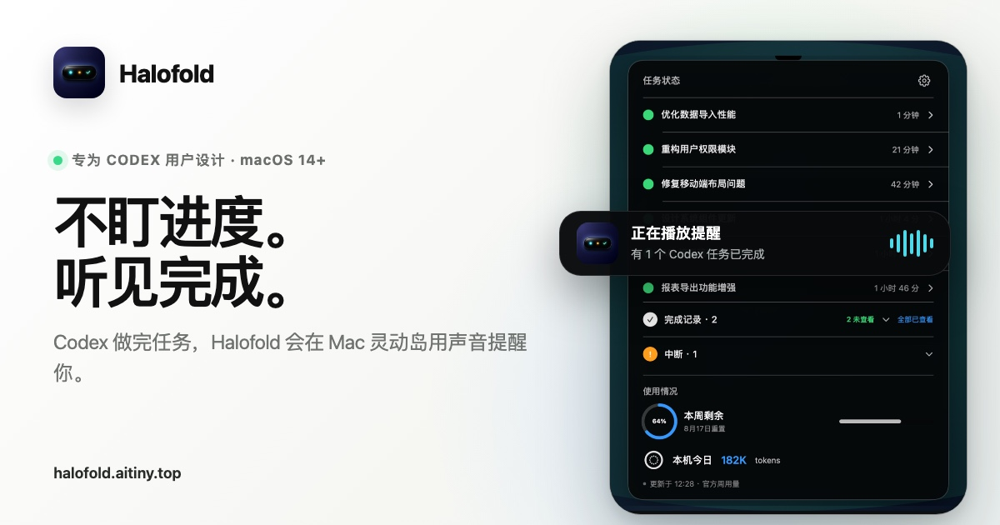

# Halofold

> 不盯进度，听见完成。




Halofold 是一个原生 macOS 顶部工作中枢。它把后台任务的进度、随手记下的想法和今天真正要做的事，收进屏幕顶部一个随时可展开的空间：Codex 需要你时会提醒，任务完成时会播报，计划到点时会出现，灵感则留在本机。

## 你可以用它做什么

### 听见 Codex 的关键时刻

- 自动区分运行中、待你处理、完成和中断，不必来回切换窗口盯进度。
- 当 Codex 需要登录、确认、授权、选择或补充信息时，给出简短、可行动的本地提醒。
- 完成和中断都可以使用系统语音、录音或自定义音频播报。
- 顶部同时显示官方周用量和这台 Mac 的今日 Token，帮助你了解使用节奏。

### 在任何地方接住灵感

- 按 `⌘⇧Space`，无需切换应用即可新建便签。
- 支持标题、加粗、引用、列表和任务列表。
- 自动保存并轮换最近 30 份本地备份；没有账号，也不会上传云端。

### 把计划变成正在发生的行动

- 创建一次性计划或每周重复计划，集中管理今天与未来的安排。
- 到点后先确认是否开始，再进入倒计时，减少“提醒看到了，但事情没开始”的空转。
- 临时被打断时可以稍后提醒、延长、改期或取消；完成后也能修正历史记录。
- 内置喝水和活动等轻量日常提醒；专注任务进行中会自动避让，避免连续打扰。

## 三个工作空间，一个清晰节奏

| 工作空间 | 解决的问题 | 你得到什么 |
| --- | --- | --- |
| 活动 | Codex 现在做到哪了？ | 进度、待处理动作、完成提醒和用量 |
| 便签 | 刚刚那个想法放哪里？ | 全局快捷记录、格式化编辑和本地备份 |
| 我的计划 | 接下来到底做什么？ | 周计划、临时计划、开始确认和倒计时 |

Halofold 的重点不是再增加一个任务列表，而是把“后台在发生什么”和“我现在要做什么”放在同一个低干扰入口里。

## 本地优先与隐私

- 不需要注册账号，不接入分析 SDK，也没有 Halofold 云端服务。
- 经你授权后，只读访问本机 `~/.codex` 中的任务状态、标题和对话结果；不会读取、复制或保存 Codex 登录凭据。
- “待你处理”使用本地规则把最终回复转换成安全短提示，不朗读密码、验证码或其他敏感内容。
- 设置、便签、计划、去重记录与提醒音频保存在 `~/Library/Application Support/Halofold`。
- Mac 睡眠或锁屏期间不会补发已经错过的日常提醒，避免唤醒后集中打扰。

> 源码保留了一套实验性的“从 Codex 对话发现待办”实现，方便社区研究和迭代；官方 DMG 默认通过 `HALOFOLD_NO_CODEX_TODO` 将这项功能排除，不会出现在安装版本中。

## 下载与安装

从 [Halofold 官网](https://halofold.aitiny.top/) 或 [GitHub Releases](https://github.com/tinyray1314/halofold/releases) 下载最新的 `Halofold-1.1.0.dmg`：

1. 打开 DMG，把 Halofold 拖入 Applications。
2. 当前版本使用临时本地签名，尚未完成 Apple Developer ID 公证。首次打开若被 macOS 拦截，请前往“系统设置 → 隐私与安全性”，确认仍要打开。
3. 应用会常驻菜单栏；按界面引导授权读取本机 `.codex` 目录，即可获得准确的 Codex 状态。

系统要求：macOS 14 或更高版本；同时支持 Apple 芯片与 Intel Mac。

## 本地开发

```bash
swift test
swift run CodexIsland
```

视觉验收模式（使用独立演示数据，不读写真实 Codex 状态）：

```bash
swift run CodexIsland --demo
```

生成个人使用的 `.app`：

```bash
./scripts/package_app.sh
```

生成可分发的 `.dmg`：

```bash
./scripts/package_dmg.sh
```

## 项目结构

```text
Sources/CodexIsland/   macOS 应用源码
Tests/                 Swift 单元测试
Resources/             图标、本地化与应用配置
scripts/               构建和打包脚本
website/               halofold.aitiny.top 官网
AppStore/              产品规格与历史发布材料
```

## 已知限制

- 当前 DMG 未经过 Apple 公证，首次启动需要用户手动确认。
- 周用量依赖本机已安装的 Codex app-server；读取失败时会保留最近一次本地结果并显示来源。
- 今日 Token 只统计本机当天的 Codex JSONL 增量，不代表同一账号在其他设备的消耗。
- 外接无刘海屏不会绘制模拟黑岛，菜单栏入口仍然可用。

## 参与开源

欢迎提交问题、功能建议和 Pull Request。开始前请阅读 [贡献指南](CONTRIBUTING.md)、[安全政策](SECURITY.md) 与 [行为准则](CODE_OF_CONDUCT.md)。版本变化见 [CHANGELOG](CHANGELOG.md)。

## 许可证

代码以 [MIT License](LICENSE) 开源。Halofold 名称、图标和视觉品牌不随 MIT 许可证授权；第三方组件说明见 [THIRD_PARTY_NOTICES](THIRD_PARTY_NOTICES.md)。
