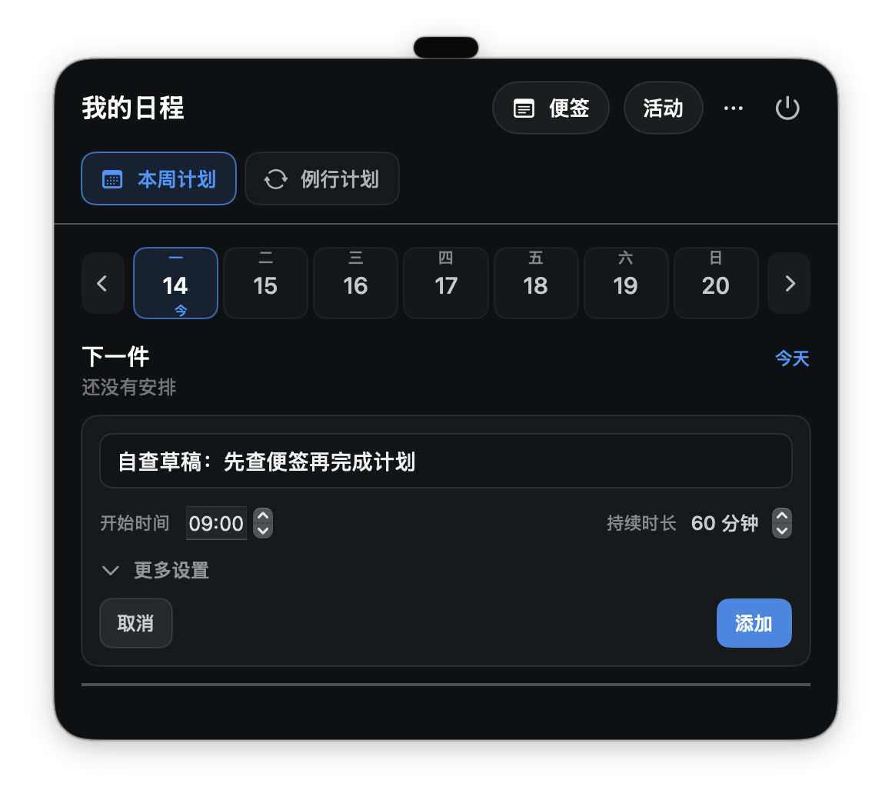
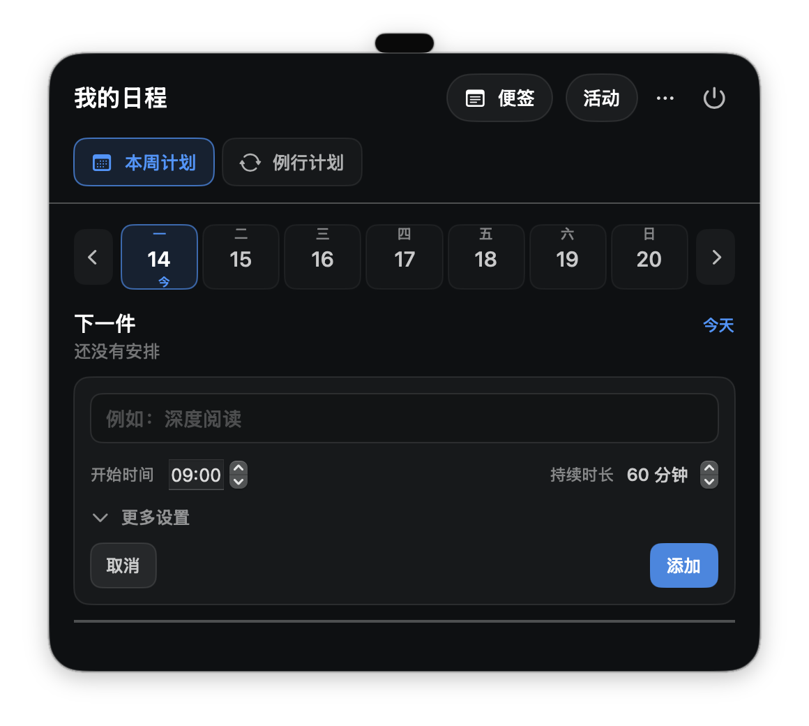

# Halofold UI / 交互自查

本轮判断优先级：先避免丢失输入、遗漏待处理事项和不明确的异常反馈，再统一导航和编辑流程，最后收敛视觉细节。原有深色、紧凑、顶部快速访问的方向可以保留。

本次没有修改产品代码。依据是 39 个原生界面状态、当前源码，以及独立采集程序中的实际切换复现。下面明确区分行为确认、代码证据和设计取舍。

## 对上一轮 8 条线索的修正

- G01 设置入口、G02 空间切换、G04 退出位置可合并成「统一应用级导航」，不应分别重做三次。
- G03 蓝色多义成立，但更适合纳入视觉规则，优先级低于数据和流程问题。
- L01 待处理信息在运行任务下方、L03 编辑器在列表末尾，保留为明确结构问题。
- L02 全覆盖倒计时属于专注强度与访问自由的产品取舍，不直接归为 bug。
- L04「需要滚动」不是问题本身。应评估分组、首屏覆盖、滚动时的上下文，而非强求所有设置同屏。
- 调整时间弹窗的浅底浅字问题仍是采集宿主外观异常，尚未在正式 NSPanel 复核，不纳入已确认产品缺陷。

## 第一批：应优先处理

### R01 日程草稿随跨空间切换丢失

**证据：实际复现 + 代码。** 在独立原生采集窗口打开「添加日程」，通过可访问性输入接口设置标题「自查草稿：先查便签再完成计划」，确认添加按钮变为可用；切到便签，再返回日程，表单关闭；重新打开后标题为空、添加按钮禁用。没有保存，故没有创建真实或演示日程。

复现路径：添加日程 → 填写标题 → 便签 → 日程 → 添加日程。

原因：`ScheduleWorkspaceView` 的 draftTitle、编辑 ID、表单打开状态等都是页面局部状态；`IslandView` 按工作空间分支创建/移除视图。进入设置也使用另一个分支，因此存在相同风险，但本轮仅实际复现跨空间切换。

**建议：** 在当前应用会话中保留未提交草稿、所选日期和编辑位置。提交后清空；显式取消时丢弃。首轮不必做跨重启草稿同步。不要用每次切换都弹确认来打断用户。

**验收：** 未提交表单跨空间或进入设置后返回，内容与编辑位置仍在；已保存和已取消的草稿不会重复出现。编辑已有项目时原记录只在保存后改变。

代码：`Sources/CodexIsland/UI/ScheduleWorkspaceView.swift:12`；`Sources/CodexIsland/UI/IslandView.swift:73`。

### R02 需要用户行动的事项被运行列表挤到下方

**证据：原生截图 + 代码。** 8 条运行任务的演示数据占满活动首屏，待你处理与完成汇总在其后。需要登录/确认的事项还需要展开分组才能读到原因。

**建议：** 待处理事项放在固定的首屏摘要区域；直接显示简短原因和「查看任务」。后面才是运行中、完成/中断记录、用量。运行列表先展示少量条目，可展开全部。待处理为零时收起该区域。

**验收：** 增加运行任务数量不会把待处理入口推离首屏；从入口可打开正确任务；零待处理不会出现空壳卡片；大量待处理时仍能看到数量和明确入口。

截图：`../screenshots/activity-main.png`、`../screenshots/activity-action.png`。代码：`Sources/CodexIsland/UI/IslandView.swift:278`。

### R03 错误原因被正常更新时间盖住

**证据：原生异常状态截图 + 代码。** 异常状态只把底部小圆点改成橙色，文本仍为「更新于… · 官方周用量」。`freshnessText` 只要 usage.updatedAt 存在就不显示 sourceMessage。

**建议：** 异常时优先显示「连接异常 / 需要授权」以及一个相关操作入口；历史更新时间作为次级信息保留。不同异常对应不同动作，不是一律要求重新授权。

**验收：** 有旧用量缓存时发生来源错误，仍能看到当前原因；恢复后清除错误；不通过颜色单独表达是否正常。不得把全部失败都归为授权问题。

截图：`../screenshots/activity-warning.png`。代码：`Sources/CodexIsland/UI/IslandView.swift:508`。

### R04 删除操作缺少一致、可达的恢复方式

**证据：代码检查，未执行删除。** 便签菜单直接删除当前便签，没有该层级的确认或撤销入口。一次性日程的撤销只显示 2.4 秒；自定义例行事项和删除后续日程没有对应的可见撤销。后台备份不能替代普通用户可以找到的恢复流程。

**建议：** 单项删除提供明显撤销，并保留足够响应时间，例如先以 8 秒作为待测试的设计值；批量删除后续日程先明确影响范围，再确认或提供完整的批量恢复能力。不要给每个普通点击都加确认。

**验收：** 普通用户无需查文件就能恢复误删的单项；恢复内容与原项目一致；删除后续能先看懂影响范围，不能只恢复一条却声称恢复了全部。

代码：`Sources/CodexIsland/UI/NotesWorkspaceView.swift:122`；`Sources/CodexIsland/Core/NoteLibraryModel.swift:101`；`Sources/CodexIsland/UI/ScheduleWorkspaceView.swift:1003`、`:1027`。

## 第二批：统一主要操作链路

### R05 统一导航、设置、收起与退出的位置

**证据：原生截图 + 实际切换。** 三个空间各自把另外两个空间作为跳转按钮，按钮尺寸和位置随所在页面改变。设置在活动页是齿轮，在另两页是更多菜单子项。退出长期占据每个顶部工具栏，而面板内没有同样明确的收起按钮；顶部两翼仍可收起，所以不能说产品完全无法收起。

**建议：** 固定顺序「活动 / 便签 / 日程」，三个入口都显示，当前位置有统一选中样式。右侧固定设置和收起；退出留在菜单栏应用菜单。设置作为临时页面，返回之前空间并保留状态。初步建议顺序可讨论，不把它当成唯一正确方案。

**验收：** 同一入口在三个空间的位置一致；切换可一击完成；收起不停止监测；退出仍可找到并有清楚后果；通过屏幕阅读器可知道当前空间。

### R06 日程编辑入口、表单位置和默认值一起优化

**证据：截图 + 代码。** 本周新增表单在列表前，已有项目行内编辑，自定义例行事项编辑在整个列表末尾。新增默认时间固定 09:00，即使当前已经下午。当前界面只有日号和星期，没有一直可见的月份/完整所选日期。「更多设置」目前只承载重复规则。

**建议：** 一次性与例行事项沿用同一个编辑区域的位置和保存/取消规则；进入编辑自动对齐表单，保存区可达，不要求用户寻找屏外表单。今天的新计划默认到当前时间之后的合理刻度；未来日期保留偏好时间。显示所选完整日期或当前周范围。重复规则直接显示一行「重复：不重复」，不再为一个选项藏一层。时长可直接输入，辅以少量常用值，避免只能反复点小箭头。

**验收：** 列表再长也能看见当前编辑对象和提交位置；跨月时知道是哪一天；今天新建不会无意落到过去；重复规则收起/展开不会悄悄丢失用户选择。

代码：`Sources/CodexIsland/UI/ScheduleWorkspaceView.swift:183`、`:580`、`:946`、`:524`。

### R07 倒计时保留专注感，但默认不要阻断其他空间

**证据：截图；建议属于产品取舍。** 等待、超时、进行中三个状态覆盖所有导航。用户若想临时看便签，面板内无法直接切换。

**建议：** 默认保留顶部导航，运行状态以紧凑的持续条显示在各空间，点击展开大倒计时；切到便签不等于暂停或结束计划。需要更强约束时再提供显式的专注视图，而非默认强制。

**验收：** 运行中切空间不丢计时、不重复开启任务；仍能随时完成、延长或稍后处理；提醒的可见性不会因改成紧凑条而消失。

这是实施前需要与用户对齐的产品选择，本轮只给建议。

## 第三批：视觉收敛与设置分组

### R08 统一层级，而非给所有元素加大、加亮

**证据：截图 + 样式定义。** 活动标题与另两个空间的字号/字重不同；同类空间跳转有不同高度、边框和强调方式。胶囊、圆角块、描边和分割线反复叠加。日程时间说明为 10.5pt 且白色透明度 0.38，信息重要性与可读性不匹配。

**建议：** 保留深色紧凑风格，先统一页面标题、正文、次级信息三档；必要时间/状态不要降到极弱颜色。主操作用明确强调，普通跳转保持中性，选中状态遵循同一规则。圆角与间距收敛为少数档位；能用留白区分的区域减少重复边框。只给当前状态与主要操作足够突出的位置。

**验收：** 三个空间并排看有同一套导航、标题、按钮和间距；关键时间与状态在原始 1 倍尺寸可读；不通过放大整个窗口才能补救局部拥挤。

### R09 设置按用途分组，默认暴露常用项

**证据：截图 + 源码。** 语音页把待处理说明、完成设置、中断设置和系统音量纵向堆叠。通用页还包含演示、数据来源等较低频内容。返回箭头与「完成」调用同一个动作，并非两种保存方式。

**建议：** 语音先给出事件开关与简短预览，深入配置放在对应事件的编辑区；音色/音量保持容易找到。通用中的演示与诊断集中归类。设置既然自动保存，就统一返回语义，避免用户以为必须点击「完成」才保存。允许合理滚动，先改善分组，不追求全部同屏。

**验收：** 用户能判断设置是否自动保存，能快速关闭一种提醒或修改音量，低频诊断不会挤占主要设置；不因收起高级项而让常用设置多出不必要步骤。

## 暂不做

不全面改色、不扩大所有窗口、不为美化重写所有页面、不先把全部 UI 重建成 Figma 图层。不在缺少正式窗口证据时断言刘海定位、动画性能、快捷键或浅色弹窗已经存在产品故障。

## 建议实施顺序

1. 修草稿、待处理优先、异常反馈和删除恢复。
2. 对齐固定导航与编辑规则，先完成活动 → 便签 → 日程 → 设置一条完整路径。
3. 确定专注时的访问自由度。
4. 提取并应用公共视觉规则，逐页做原始尺寸截图对照。

本轮自查补充了草稿切换前/后两张截图；之前全景册中的 8 个线索仍保留为第一轮观察，本报告优先级更新于其后。
